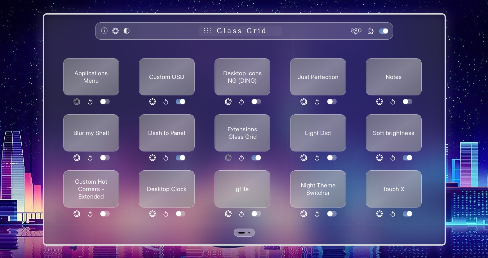
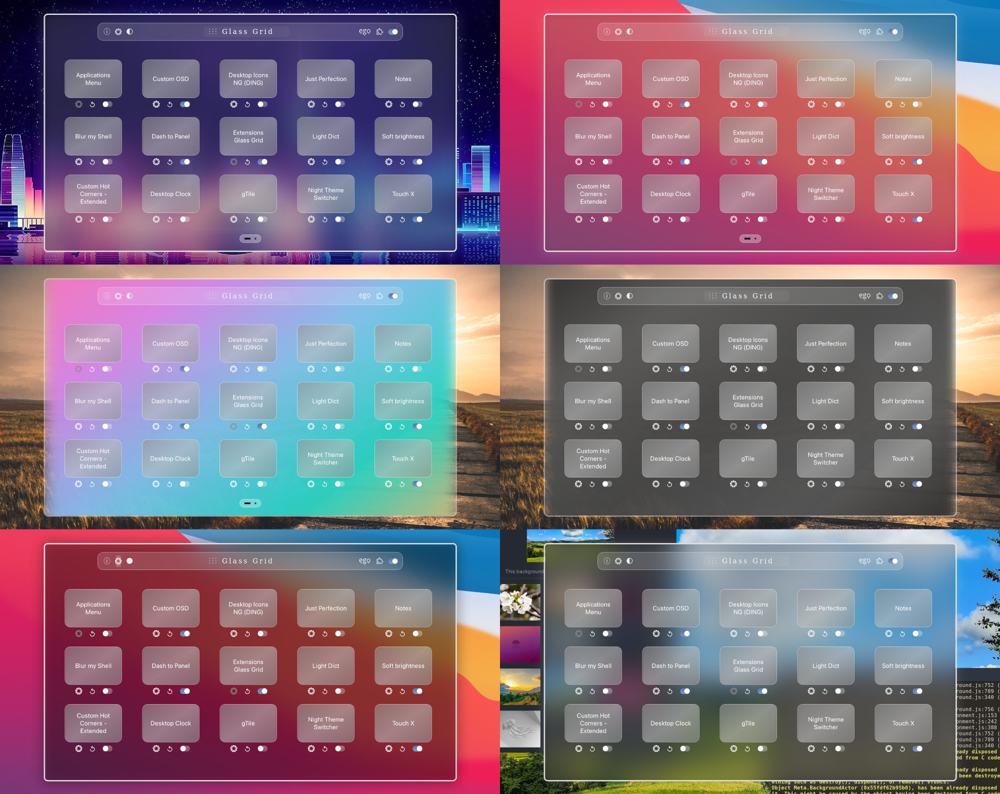
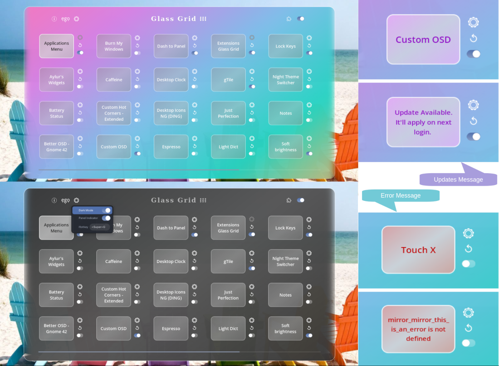

# Extensions Glass Grid (GNOME 4X Extension)  


A GNOME Shell extension to manage installed extensions. It pops up an overlay panel with glass effect and a grid of installed extensions. It can be quickly launched or dismissed using a panel indicator toggle or a hotkey toggle. Currently supports functions like: enable / disable individual extensions, open their preferences, reload their stylesheets (without having to disable/enable the extensions), shows when there is an update available or when there is an error in an extension. You can also enable / disable all extensions at once (as sometimes needed for debugging). Additionally, provides buttons to open e.g.o (extensions website) and Extensions app. Comes with many themes that can be set from the overlay panel itself.  

  


## Installation

### Recommended

[](https://extensions.gnome.org/extension/6269/extensions-glass-grid/)

It's recommended to install the extension from
[extensions website](https://extensions.gnome.org/extension/6269/extensions-glass-grid/), or from
the _Extension Manager_ app.


### How to manually install the extension (if needed)?

```
git clone https://github.com/neuromorph/glass_grid.git \
	~/.local/share/gnome-shell/extensions/extgrid@neuromorph
```
OR download the release zip file (may not be latest) and unzip at location: ~/.local/share/gnome-shell/extensions/

You may need to restart the gnome shell environnment (for manual install):

- logout and login again (Do this if using Wayland) _or_
- `alt+f2` then type `r` and `enter` 


## User Guide  
- The UI is non-standard for a shell extension. It is more like artisanal / hand-crafted. Since it doesn't directly leverage existing UI (e.g. panel menu), the inputs are handled on its own. If you notice anything totally off, do report an issue. 
- The overlay can be quickly launched / dismissed using indicator toggle button in Panel or using a hotkey (default: \<Super>E). Both can be set from the Settings menu in the overlay itself.
- The overlay will dismiss on Esc or automatically when it looses key focus. That is when you trigger open something e.g. extension preferences or when you click on some other app. [Note below].    

Header / Top layout:
- Info button: It will open an about dialog also showing brief tool guide.
- Settings button: Opens a menu with settings for Dark/Color mode, Indicator button Add/Remove, launch Hotkey.
- Theme Mode: Toggle between Dark and Light modes.
- ego button: Opens extensions.gnome.org
- Extension app button: Launches the Extensions app.
- Switch: Enable / Disable all the extensions. It does not disable itself here for obvious reasons. Specifically disabling Glass Grid from it's own entry in the grid will disable itself. Enabling all will enable the extensions that were enabled before you pressed Disable All.  

Grid Layout:
- Extension Name button: By default, it will open the extension preferences. If the extension has an update, it will show update-message. If the extension has an error, it will show error-message.
- Settings button: It will open the extension preferences. Gray button means the extension does not have preferences (so disabled).
- Reload button: It will reload the extension stylesheet css file(s). This is useful when you are trying to customize an extension's style.
- The grid layout scrolls horizontally when number of extensions are more than a page capacity. (Page Switcher popup animation included).
- You can use keyboard arrow keys to navigate (supports automatic pagination when key-focus moves to another page). When opened, key focus would be on the title.  

Note: This is since as a Gnome shell extension, the UI overlay is essentially transient like the panel menu. Glass grid is more persistent than the panel menu by design but less than an app window since it is not a desktop app. So think of it like the app grid in overview, to get some idea.


## Settings
Use the Settings menu from the extension for :
- Select Background theme (5 options) and Mode (dark/light/neutral)
- Add / Remove Panel indicator to toggle Glass Grid
- Set hotkey to toggle Glass Grid


## What's New (recent first)
- Mainly performance improvement for smooth operation even with several pages full of extensions. Some UI refinements.
- Update with more options for background theme including background blur and dynamic blur. Also, rewrite to improve input handling for mouse, keyboard, trackpad as well as touchscreen.
- Initial version, already working, to be submitted to gnome.extensions.org


## Screenshots
  
 


